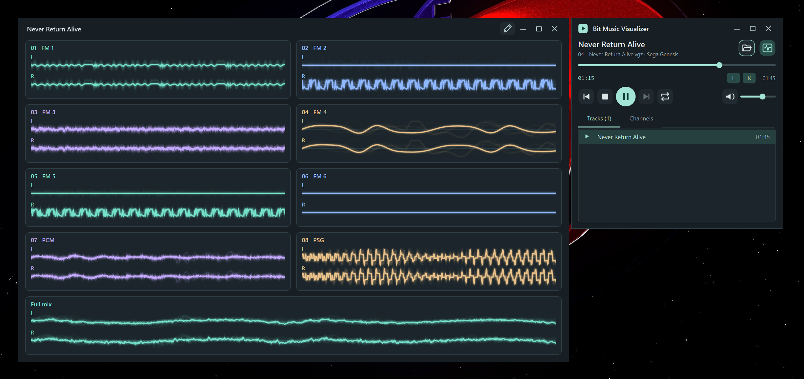

# Bit Music Visualizer

A compact chiptune player with a separate, customizable oscilloscope window.
Explore the voices inside retro game music, mute channels, and compare them
with the final audio mix.

Built with C++17, Qt 6 and a modified Game Music Emu backend. Music is not included.

## Features

- Play, pause, stop, seek, repeat, and select subsongs within a music file.
- Independent voice mutes and left/right output switches.
- Mono or stereo waveforms; optional Full mix showing the PCM sent to the audio
  device, including active voices, volume and shared effects.
- Editable grid: hide, reorder and resize cards in whole grid cells.
- Per-card colors, HEX input, named INI themes and a configurable window background.
- Smooth/instant/fixed amplitude, stable/rising/off trigger, GPU glow and fading
  trails. CPU rendering is available as a fallback.
- Remembered theme, waveform/effect/renderer preferences and window geometry.

## Formats

| System | Files | Visualization boundary |
| --- | --- | --- |
| NES / Famicom | NSF, NSFE | Base voices and backend-supported expansion audio |
| Mega Drive / Genesis | VGM, VGZ | FM and DAC voices; PSG is one combined group |
| Master System | VGM, VGZ | PSG and YM2413 FM; rhythm voices share FM 7–9 |
| SNES | SPC | Eight dry DSP voices; shared echo appears in Full mix |
| Game Boy | GBS | Square 1, Square 2, Wave and Noise, with L/R routing |
| ZX Spectrum | AY (ZXAYEMUL) | AY A/B/C and beeper; mono output |

VGM is a container: accepting it does **not** mean every chip is supported. PT3,
VTX, YM, SID, Amiga/tracker modules and MIDI are not supported yet. There are no
invented durations or titles: files without duration data keep playing until
stopped. Cold seeks can require emulation from an earlier point. Voice traces
are not guaranteed to be exact separately audible stems after shared effects.

## Run

See [Releases](https://github.com/divanikus/bitmusic-visualizer/releases).
Extract the complete archive and keep its libraries, licenses and source bundle.

- **Windows x64:** run `bitmusic_visualizer.exe`. No installation or Qt SDK is needed.
- **Linux x64:** download the AppImage, allow execution (`chmod +x *.AppImage`),
  then run it. It bundles Qt, libgme and ICU; system graphics, X11 and audio libraries
  remain required. The build baseline is Ubuntu 22.04 / glibc 2.35, with a Fedora
  compatibility check. Use `--appimage-extract-and-run` if FUSE is unavailable.
  See [Linux requirements](docs/BUILDING.md). XWayland is needed on Wayland desktops.
- **macOS Apple Silicon:** open `BitMusicVisualizer.app`. Builds are not notarized
  or signed with an Apple Developer ID. Permit the application in Privacy & Security
  only if you trust its source. Intel Mac binaries are not currently provided.

Windows is locally tested. Linux/macOS packaging and CI are new; check a release's
notes for its actual platform validation, rather than treating a successful
compilation as a listening or GPU compatibility test.

Open a file with Ctrl+O or drag it onto the player. Tracks lists subsongs within
that file; double-click to play one. Channels controls sound. The scopes button
shows/hides the separate window; closing that window keeps playback running.

In the scope editor, drag cards to reorder and drag their edges/corners to resize.
Apply finishes editing. Reset restores the grid and visibility, keeping colors.
Keep grid retains only row/column counts when opening a new file. Layouts are
session-local. Full mix starts hidden and can be enabled in Channel visibility.
Theme selection applies immediately; Save theme asks for a name.

See [waveform controls](docs/VISUALIZATION.md) and [theme format](packaging/THEMES.txt).

## Settings and diagnostics

| Platform | Settings | Themes |
| --- | --- | --- |
| Windows | `BitMusicVisualizer.ini` beside the EXE | `themes/` beside the EXE |
| Linux | `$XDG_CONFIG_HOME/BitMusicVisualizer/BitMusicVisualizer.ini` | `$XDG_DATA_HOME/BitMusicVisualizer/themes/` |
| macOS | `~/Library/Preferences/org.bitmusicvisualizer.BitMusicVisualizer.plist` | `~/Library/Application Support/BitMusicVisualizer/themes/` |

Linux defaults are `~/.config` and `~/.local/share`. Missing/corrupt saved themes
fall back to Default. Unsaved color edits are not written automatically.

`--software-scopes` disables GPU effects for that launch. `--diagnostics` enables
bounded local logs (beside the EXE on Windows, in the app's data directory elsewhere).
Logs can contain device information and file paths; review them before sharing.
There is no telemetry, automatic upload or updater. A GPU timeout falls back to
CPU scopes; driver-specific failures may still require restarting the player.

## Build and license

[Build/test instructions](docs/BUILDING.md) · [Third-party notices](THIRD-PARTY.md)

Application code, original artwork and authored fixture generators are under
the [MIT license](LICENSE). The libgme modifications in `native/gme-taps/` are
**LGPL-2.1-or-later**, including patch content applied by `cmake/PatchGme.cmake`.
Qt, libgme, zlib and compiler runtimes keep their own licenses. Release packages
dynamically link Qt and libgme and include their corresponding source and notices.
